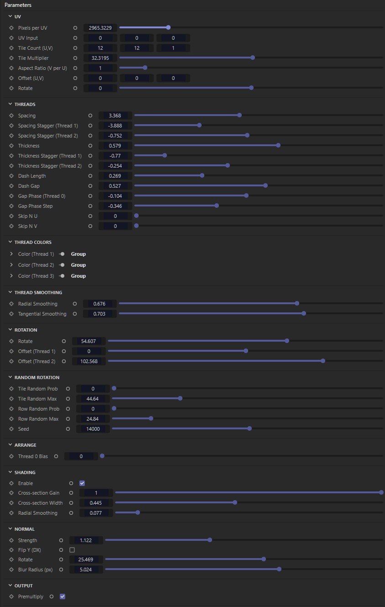

# Thread Weaver – OSL Shader


Procedural thread and fabric pattern generator for Redshift (Cinema 4D) and other OSL-compatible renderers.

### UI




Pattern Design Logic

The foundation of Thread Weaver is a simple, UV-tile-aware circular line pattern. These concentric lines are dashed to simulate thread segments, and by scaling, rotating, and allowing them to intersect across tile boundaries, the shader creates the illusion of interlocking threads. mimicking woven fabric structures.

To add realism and depth, edges of the lines can be blurred inward and outward, softening transitions like real threads with raised surfaces. A tangential smoothing function is used to blur dash tips, faking the depth and shadowing where threads dip beneath or over each other.

Three independently controllable thread color inputs/tile idx 1, 2, and 3. can be offset, rotated, or scaled to create layered weaving effects. This tri-blend system gives artists full control over how the weave interlocks, overlaps, and flows.


# Code Structure Guide

This section explains the shader architecture for developers and shader artists.

### 1. Metadata & Header

- Declares shader name, author, and UI categorization
- Redshift metadata for organized UI pages

### 2. UI Parameters

Organized into several intuitive pages:

- UV Setup: tile count, scale, alignment
- Threads: dash length, bias, blend, spacing
- Normal: height depth, normal sharpness
- Random Dim: seed, probability, randomness, intensity
- Output: toggles, color settings

### 3. Utility Functions

Helper functions used in evaluation:

- `rect1D()`, `smoothpulse()`: used for shape and fade of dashes
- `generate_dash_pattern()`: core logic for thread segments
- `compute_normal_from_height()`: simulates normals from height

### 4. Thread Generator

- Creates spaced dash lines
- Uses A/B/C thread blending
- Includes gap phase shift and directional bias

### 5. Random Dim Logic

- Selects tiles randomly to darken or fade
- Useful for aging/worn materials or generative art
- Outputs mask of dimmed tiles for further blending

### 6. Normal & Height Evaluation

- Dynamically generated based on dash structure
- No need for baked maps or external textures

### 7. Output Section

- Assigns final outputs for Redshift or DCC integration:
```osl
Ci = outColor;
Oi = outAlpha;
