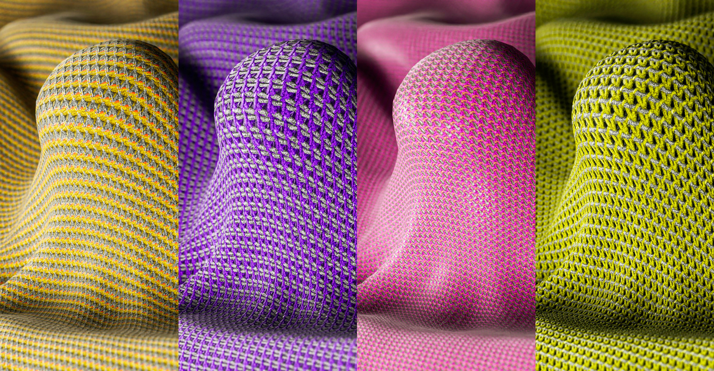

# Thread Weaver – OSL Shader

Procedural thread and fabric pattern generator for Redshift (Cinema 4D) and other OSL-compatible renderers.

### UI

### Known Issue (v1.185)

When `PixelsPerUV` is set below 1500 and `Spacing` is high (above 5), the shader output may break, showing black renders or missing dash patterns. This is caused by a sampling issue where thread masks collapse at low resolution. 

## Pattern Design Logic

The foundation of Thread Weaver is a simple, UV-tile-aware circular line pattern. These concentric lines are dashed to simulate thread segments, and by scaling, rotating, and allowing them to intersect across tile boundaries, the shader creates the illusion of interlocking threads. mimicking woven fabric structures.

To add realism and depth, edges of the lines can be blurred inward and outward, softening transitions like real threads with raised surfaces. A tangential smoothing function is used to blur dash tips, faking the depth and shadowing where threads dip beneath or over each other.

Three independently controllable thread color inputs/tile idx 1, 2, and 3. can be offset, rotated, or scaled to create layered weaving effects. This tri-blend system gives artists full control over how the weave interlocks, overlaps, and flows.

# Code Structure Guide

This section explains the shader architecture for developers and shader artists.

### UI Parameters

Organized into several intuitive pages:

- UV Setup: tile count, scale, alignment
- Threads: dash length, bias, blend, spacing
- Normal: height depth, normal sharpness

### Utility Functions

Helper functions used in evaluation:

- `rect1D()`, `smoothpulse()`: used for shape and fade of dashes
- `generate_dash_pattern()`: core logic for thread segments
- `compute_normal_from_height()`: simulates normals from height

### Thread Generator

- Creates spaced dash lines
- Arrange Uses 1/2/3 thread blending
- Includes gap phase shift and directional bias

### Normal & Height Evaluation

- Dynamically generated based on dash structure

